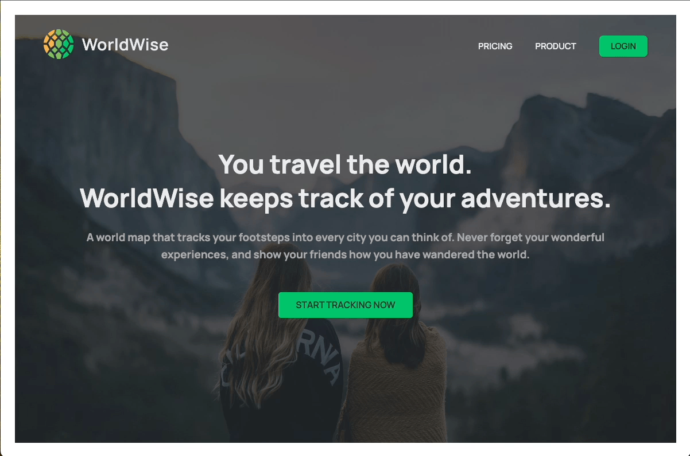

# Live Demo
 [WorldWise](https://wordwise-yuejiao.netlify.app/)
# Visual Overview
## Complete App Overview

## Separate Overview
### Homepage, Pricing Page, Product Pages

### Login

### Main App Page and User Location

### Managing Cities, Countries

# More Projects...

- [usePopCorn](https://github.com/YuejiaoShi/movie-app) - Movie Tracker app
- [React Quiz](https://github.com/YuejiaoShi/react-quiz-app) - Quiz app
- [Recipestic](https://github.com/YuejiaoShi/recipe-app) - Recipe app